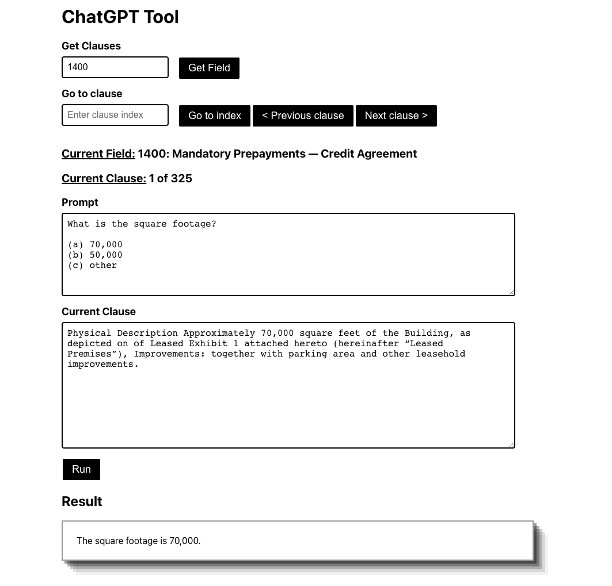
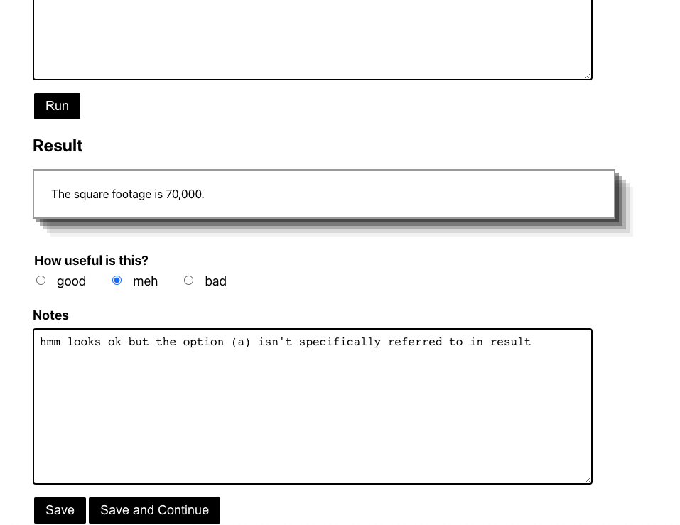

# ChatGPT Tool

This directory contains ChatGPT Tool which is a tool to help analyze clauses using ChatGPT in a systematic way.

The screenshots below show what the app looks like using a trivial example.

## How it works

To analyze a set of clauses, we can use Zuva's builtin fields. To access a field, the field's id can be used. The first clause will be displayed. We can navigate through the clauses using the buttons. Note that what I am calling "clauses" here are "annotations" or "highlights" from Zuva's builtin text fields.

The current clause is displayed in the "Current Clause" box, which can be edited if we want to experiment with custom clauses.

The prompt can be entered in the "Prompt" box

To get results from ChatGPT using the current prompt and clause click "Run". The result will be displayed below.

The results can be rated using the radio buttons ("good", "meh" or "bad").

Notes can be taken using the "Notes" box.

To save the current results click "Save", which will save the current results to a log, but will not move to the next clause (if we want to experiment with the current clause further). If "Save and Continue" is clicked the results are saved and the next clause is displayed.

Below is an example showing what is logged when the example on the screenshots above is saved.

`{"level":"info","prompt":"What is the square footage?\n\n(a) 70,000\n(b) 50,000\n(c) other","clause":"Physical Description Approximately 70,000 square feet of the Building, as depicted on of Leased Exhibit 1 attached hereto (hereinafter “Leased Premises”), Improvements: together with parking area and other leasehold improvements. ","result":"The square footage is 70,000.","rating":"meh","notes":"hmm looks ok but the option (a) isn't specifically referred to in result","time":"2023-04-06T14:44:16-04:00","message":"Info message"}`

## How to run

There are 2 parts, the backend and the frontend.

### Backend
To start the backend, navigate to the `server/` directory and `go install`. To start the server run the following command.

`chatGPT-tool server -i "path/to/docid-annotations.csv" -l path/to/logs.txt -d "path/to/FieldNameDescriptionGuid.csv" -k "$OPENAI_API_KEY"`

For the command to run `docid-annotations.csv` is required. This can be downloaded from a google cloud bucket [here](https://storage.cloud.google.com/builtin-fields-annotations/docid-annotations.csv).

`FieldNameDescriptionGuid.csv` is also required (used to map field id's to field titles) and can be found [here](https://github.com/zuvaai/ml-research/blob/master/Farhan/data/FieldNameDescriptionGuid.csv).

The name of the logfile must be specified.

An OpenAI API key is also required. See [here](https://platform.openai.com/docs/api-reference/authentication).

### Frontend

To start the frontend end navigate to the `client/` directory and `npm start`. This should open a browser tab with the app ready to use! (you may need to run `npm install` first)

Note that this starts the app in dev mode which is how I have been using it. To build it for production see [here](https://facebook.github.io/create-react-app/docs/deployment).
